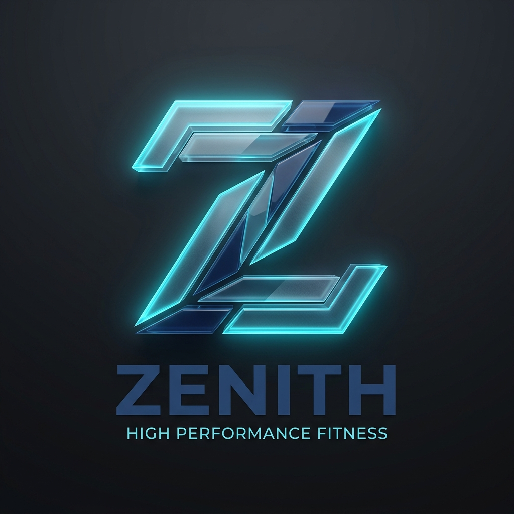
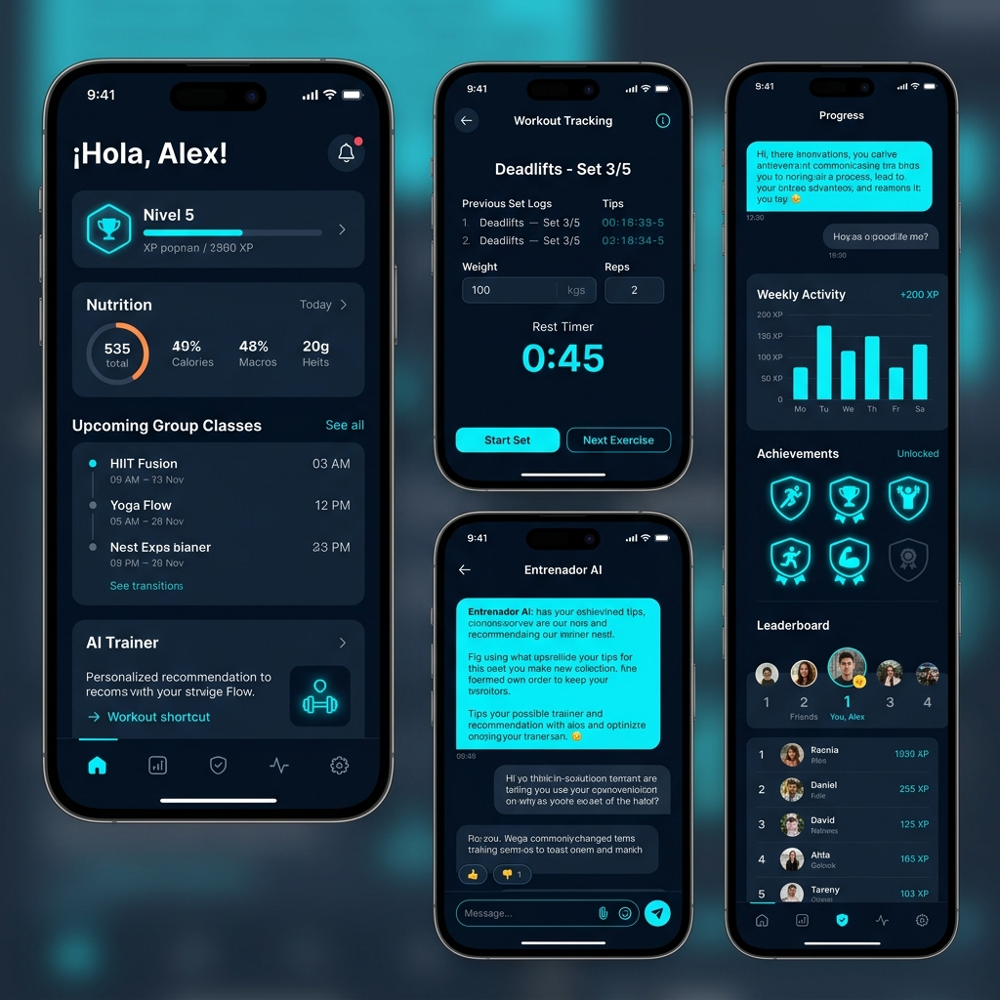
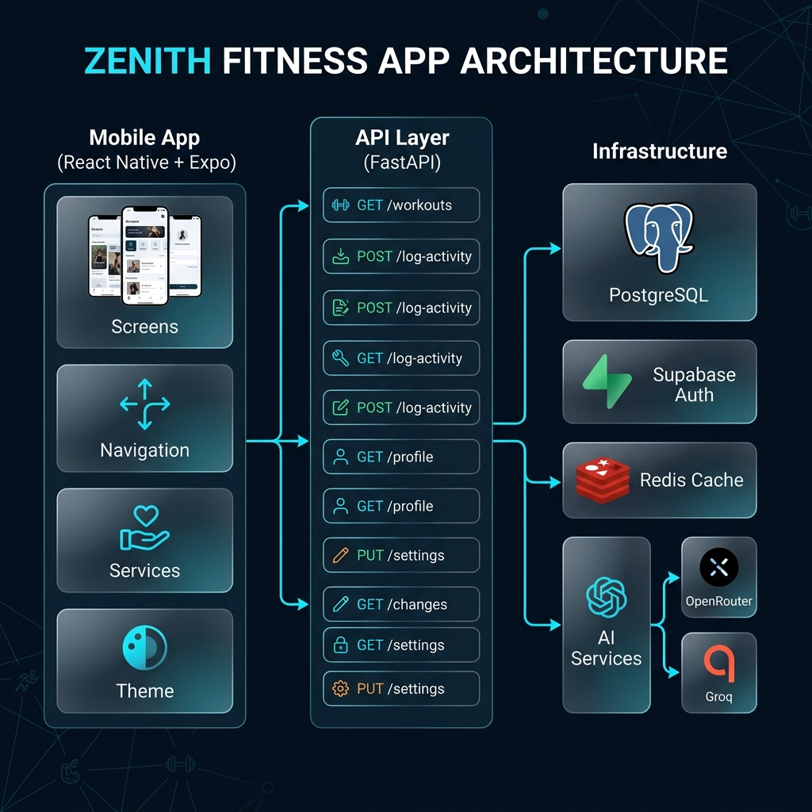
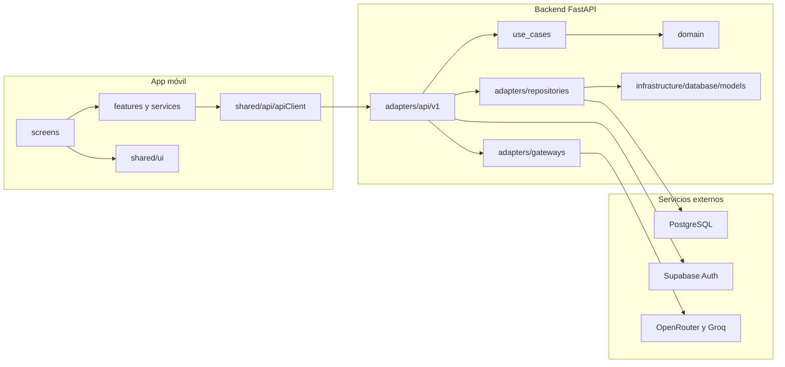

<div align="center">



# Zenith

### Alto rendimiento. Entrenamiento inteligente.

[](https://reactnative.dev/)
[](https://expo.dev/)
[](https://fastapi.tiangolo.com/)
[](https://www.postgresql.org/)
[](https://supabase.com/)
[](https://www.typescriptlang.org/)
[](https://www.python.org/)

**Zenith** es una aplicación móvil de fitness con backend propio, autenticación con Supabase y funciones de IA apoyadas en APIs externas. El estado actual del proyecto ya cubre flujos reales de entrenamiento, nutrición, progreso, clases grupales y entrenador conversacional, con una base técnica pensada para seguir creciendo sin inflar promesas que todavía no existen en código.

[Inicio rápido](#inicio-rápido) · [Arquitectura](#arquitectura) · [Funcionalidades actuales](#funcionalidades-actuales) · [Pendientes del roadmap](#pendientes-del-roadmap)

</div>

---

## Vista previa

<div align="center">



*Panel principal, entreno activo, progreso y entrenador con IA*

</div>

---

## Arquitectura

<div align="center">



</div>

La estructura actual del repositorio sigue una arquitectura por capas inspirada en Clean Architecture:



### Estado real de la arquitectura

- `zenith-mobile` está bien separado entre `screens`, `features`, `shared`, `services` y `theme`.
- `zenith-backend` ya usa `domain`, `use_cases`, `adapters` e `infrastructure`.
- La arquitectura todavía no es una implementación estricta de puertos y adaptadores de punta a punta: algunos endpoints FastAPI siguen accediendo al ORM directamente.
- Redis aparece preparado en infraestructura local, pero su integración funcional todavía está pendiente.

---

## Stack tecnológico

<details open>
<summary><strong>Frontend móvil</strong></summary>

| Tecnología | Versión | Uso actual |
|---|---|---|
| React Native | 0.81.5 | Aplicación móvil principal |
| Expo | 54 | Tooling y runtime de desarrollo |
| TypeScript | 5.9 | Tipado estático del frontend |
| React Navigation | 7.x | Navegación por stack y tabs |
| Supabase JS | 2.99 | Sesión, autenticación y storage |
| Axios | 1.13 | Cliente HTTP centralizado |
| Expo Blur | 55 | Superficies visuales y capas |
| Expo Haptics | 55 | Retroalimentación háptica |
| Expo Image Picker | 17 | Selección de imagen de perfil |
| React Native SVG | 15.12 | Recursos gráficos y visuales |

</details>

<details open>
<summary><strong>Backend</strong></summary>

| Tecnología | Versión | Uso actual |
|---|---|---|
| FastAPI | 0.111+ | API REST async |
| Uvicorn | 0.30+ | Servidor ASGI |
| SQLAlchemy | 2.0+ | Persistencia async |
| Asyncpg | 0.29+ | Driver PostgreSQL |
| Alembic | 1.13+ | Migraciones |
| Pydantic | 2.7+ | Schemas y validación |
| PyJWT | 2.8+ | Validación de JWT |
| HTTPX | 0.27+ | Cliente para APIs externas |
| Pytest | 8+ | Suite base de pruebas |

</details>

<details open>
<summary><strong>IA y servicios externos</strong></summary>

| Servicio | Estado actual |
|---|---|
| Supabase | Activo para autenticación y storage de avatar |
| PostgreSQL | Activo como base de datos principal |
| OpenRouter | Activo para generación de rutinas |
| Groq | Activo para chat conversacional |
| Redis | Pendiente de integración real en la aplicación |

</details>

---

## Estructura del proyecto

```text
App Volt-Gym/
├── zenith-mobile/
│   ├── App.tsx
│   ├── package.json
│   ├── assets/
│   └── src/
│       ├── context/
│       ├── features/
│       ├── lib/
│       ├── navigation/
│       ├── screens/
│       ├── services/
│       ├── shared/
│       └── theme/
├── zenith-backend/
│   ├── alembic/
│   ├── tests/
│   └── src/
│       ├── adapters/
│       ├── config/
│       ├── domain/
│       ├── infrastructure/
│       ├── time_utils.py
│       └── use_cases/
├── docs/
│   └── images/
├── implementation_plan.md
└── AGENTS.md
```

---

## Funcionalidades actuales

### Entrenamientos

- CRUD de rutinas personalizadas.
- Inicio de sesiones y registro de series.
- Cálculo de XP al completar una sesión.
- Biblioteca de ejercicios con filtros por músculo y equipo.

### Perfil y panel principal

- Perfil autenticado con Supabase.
- Resumen del usuario con nivel, XP, último entreno y métricas básicas.
- Actualización de datos de perfil y avatar.

### Nutrición

- Metas diarias de calorías y macronutrientes.
- Registro de comidas.
- Registro de agua.
- Resumen diario y semanal consumido vs. objetivo.

### Progreso y gamificación

- Resumen de nivel, streak, PRs y total de entrenos.
- Historial de peso.
- Ganancias de fuerza.
- Leaderboard y elementos base de gamificación.

### Clases grupales

- Tipos de clase.
- Agenda de clases.
- Inscripción y cancelación de cupos.
- Consulta de inscritos por clase.

### Entrenador con IA

- Chat conversacional con Groq.
- Generación de rutinas con OpenRouter.
- Fallback entre proveedores si uno falla.
- Respuestas orientadas a español desde backend.

### Calidad técnica actual

- Pruebas backend para entidad de usuario, caso de uso de XP, gateway LLM, endpoints de IA y configuración de Alembic.
- Variables sensibles fuera del código y cargadas por `.env`.
- Ejemplos de entorno en `zenith-mobile/.env.example` y `zenith-backend/.env.example`.

---

## Inicio rápido

### Backend

```powershell
cd zenith-backend
python -m venv venv
.\venv\Scripts\Activate.ps1
pip install -r requirements.txt
Copy-Item .env.example .env
docker compose up -d db
alembic upgrade head
uvicorn src.main:app --reload
```

Backend local:

- API: `http://127.0.0.1:8000`
- Healthcheck: `http://127.0.0.1:8000/health`

### App móvil

```powershell
cd zenith-mobile
Copy-Item .env.example .env
npm install
npm start
```

---

## Pendientes del roadmap

Estas líneas sí están contempladas en `implementation_plan.md`, pero todavía no están completas en el código actual:

- Integración real de Redis para caché, rate limiting o ranking.
- Generación de planes de alimentación con IA.
- Recomendaciones inteligentes basadas en recuperación.
- Integración con HealthKit y Health Connect.
- Acciones más autónomas del entrenador dentro de la plataforma.
- Endurecer la arquitectura para mover más lógica desde rutas FastAPI hacia casos de uso y contratos.
- Análisis por visión computacional como fase futura.

---

## Notas de estado

- Zenith ya funciona como base seria de MVP y demo técnica.
- El proyecto está más fuerte en experiencia móvil, dominio fitness y conexión backend que en infraestructura avanzada.
- La documentación de este archivo intenta reflejar exactamente eso: lo que hoy existe, lo que está encaminado y lo que sigue pendiente.
